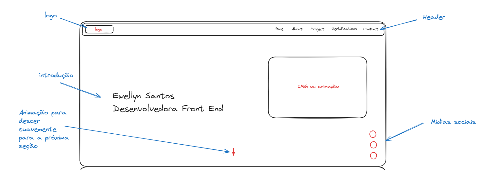

# Iniciando o projeto

Os primeiros passos para iniciar o seu projeto é ter em mente o que voce dejesa que seja feito. O ideal é buscar por ideias e inspirações e assim montar o seu protótipo, assim voce se organizará e nao terá complicações ao desenvolver seu projeto.

Conforme abaixo está a prototipagem de baixa fidelidade para este projeto.

Nao demandei muito tempo nesta parte pela pressa que tenho para concluir ele rs.

Meu projeto será de página única e terão as seguintes seções:

**Home**

<figure><figcaption></figcaption></figure>

**About**

<figure><figcaption></figcaption></figure>

**Projects**

<figure><figcaption></figcaption></figure>

**Certifications**

<figure><figcaption></figcaption></figure>

**Contacts**

<figure><figcaption></figcaption></figure>
